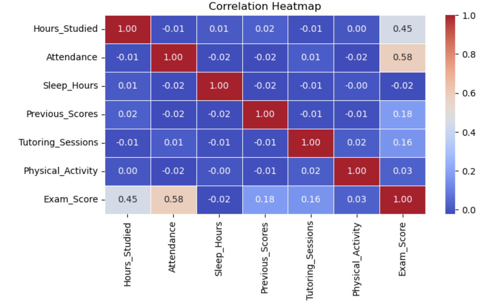
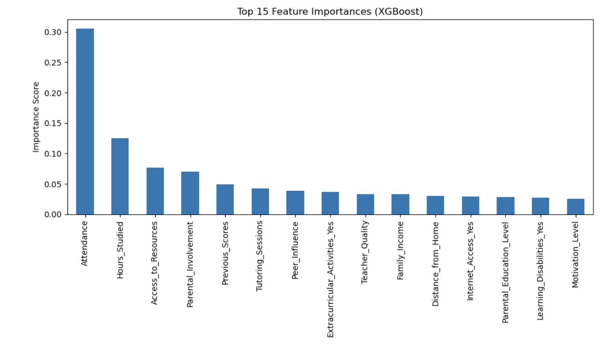

# Student Performance Prediction

This project predicts student exam scores using machine learning regression models.

The workflow includes data preprocessing, exploratory data analysis (EDA), feature engineering, model comparison, and hyperparameter tuning to identify the best-performing model.

---

# Technologies

- Python
- Pandas
- NumPy
- Matplotlib
- Seaborn
- Scikit-learn
- XGBoost
- LightGBM

---

# Project Workflow

- Loaded and explored the dataset.
- Filled missing values using the mode.
- Performed exploratory data analysis (EDA).
- Visualized relationships between variables.
- Encoded categorical features using Label Encoding and One-Hot Encoding.
- Built multiple regression models.
- Compared model performance using MAE, MSE, and R² Score.
- Tuned XGBoost using GridSearchCV.

---

# Models

- Linear Regression
- Random Forest Regressor
- XGBoost Regressor
- LightGBM Regressor

---

# Model Performance

| Model | MAE | R² Score |
|------|------:|------:|
| Linear Regression | 1.02 | 0.689 |
| Random Forest | 1.13 | 0.656 |
| XGBoost | 0.77 | 0.736 |
| LightGBM | 0.78 | 0.737 |
| **Tuned XGBoost** | **0.67** | **0.751** |

---

# Key Findings

- Attendance showed the strongest positive relationship with exam scores.
- Hours studied also had a positive impact on student performance.
- Gradient Boosting models outperformed Linear Regression and Random Forest.
- Hyperparameter tuning further improved XGBoost performance.
- Tuned XGBoost achieved the highest predictive accuracy.

---

# Visualizations

## Correlation Heatmap



---

## XGBoost Feature Importance



---

## LightGBM Feature Importance


---

# Conclusion

After comparing four regression algorithms, the tuned XGBoost model achieved the best performance.

### Best Model

- Model: **Tuned XGBoost**
- MAE: **0.67**
- R² Score: **0.751**

The project demonstrates that Gradient Boosting algorithms provide more accurate predictions than traditional regression methods for this dataset.

---

# Repository Structure

```text
Student-Performance-Prediction/

├── images/
│   ├── correlation_heatmap.png
│   ├── xgboost_feature_importance.png
│   └── lightgbm_feature_importance.png
│
├── Student_Performance_Prediction.ipynb
├── README.md
└── requirements.txt
```

---

# Author

**Shamil Emirov**

Data Analyst | SQL | Python | Power BI | Tableau

GitHub: https://github.com/ShamilEmirov

LinkedIn: https://www.linkedin.com/in/shamil-emirov-0b071032b/
